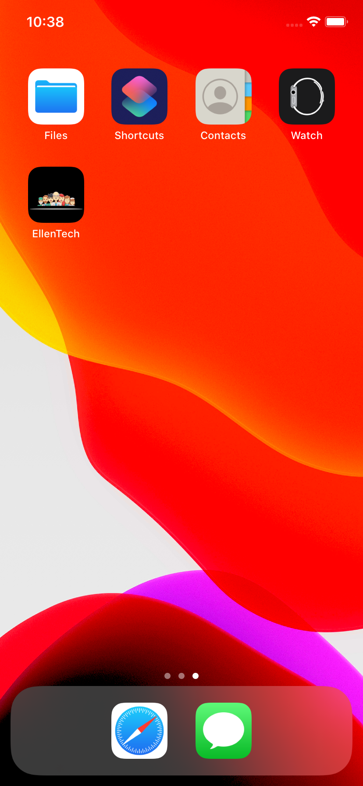
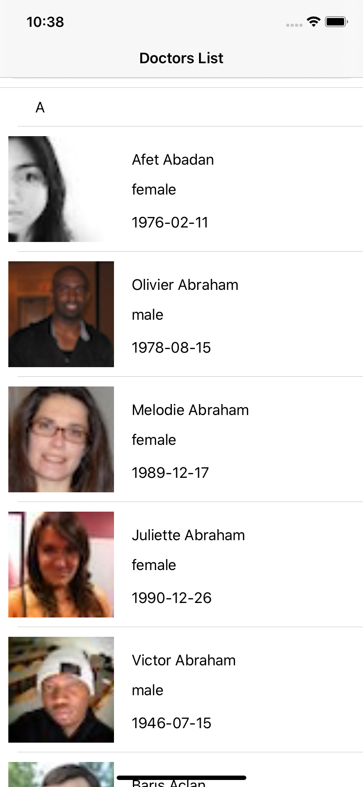
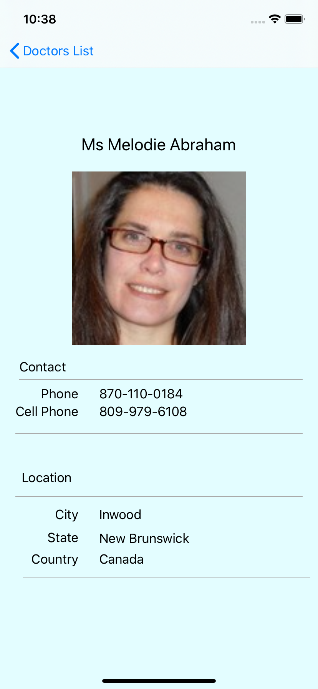
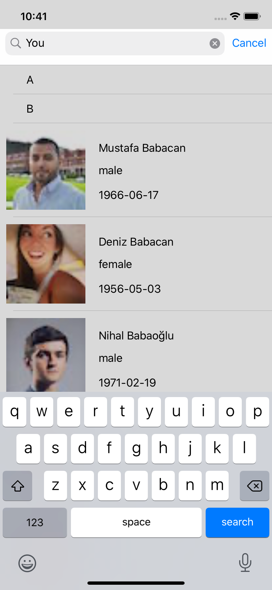
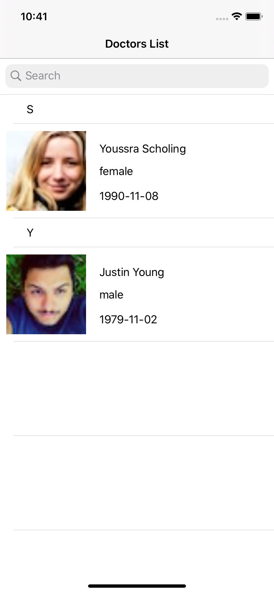

# This is a small app for a Tech interview

### Requirements
- Write an iOS application that makes an HTTP GET request to the public REST API at https://randomuser.me/.  
- pagination is required 
- The initial data should be presented in a scrollable list view (or something similar). Each item in the list should at least display the name, gender, date of birth and a thumbnail image. 
- Once tap on one item in the list, a detailed view should present more information about the selected user, including a large image.

- For the list view, some kind of search or filter functionality is also preferable.

- NOTE: the project app need to be able to work offline, therefore SQLite local storage and CoreData framework are required for this challenge.

### The important things:

- Good coding standard
- Maintainable application architecture
- Testing

### Some Screen Shots of this app

- 

- 

- 

- 

- 

- 

