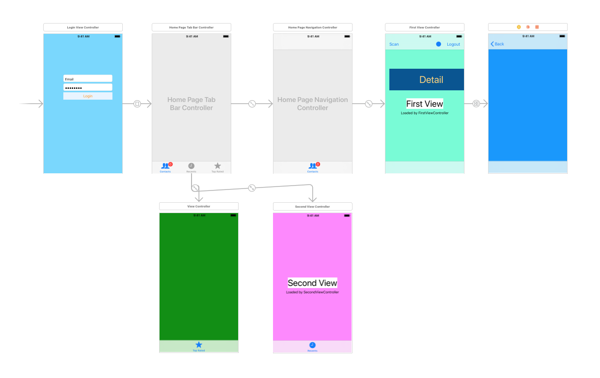

# 100DaysSwift

## 2018-08-14 (TabbedPageStudy)

- [iOS Tab Bar Controller Tutorial](https://www.youtube.com/watch?v=yzImO9HdbFo)
- [Code Pro: iOS Tab Bar Controller Tutorial](https://www.youtube.com/watch?v=erUWj0gOb7k)
- Learn about the <em>UITABCONTROLLER</em> and how to use it
- Learn how to combine <em>TAB CONTROLLERS</em> and <em>NAVIGATION CONTROLLERS</em>
- Learn how to change the <em>STARTUP TAB</em> in a <em>TAB CONTROLLER</em>
- Learn how to pass variable between <em>VIEWCONTROLLERS</em>

## 2018-08-19

- UITest
- UIPicker
- Alamofire and SwiftyJSON

- <strong>Pod intall library</strong>
1. pod init
2. subl Podfile
3. pod install
4. open .xcworkspace
5. import library

